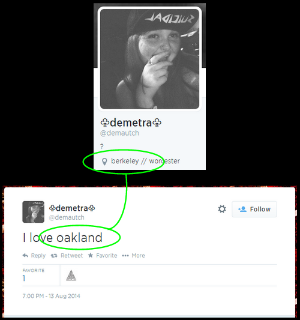
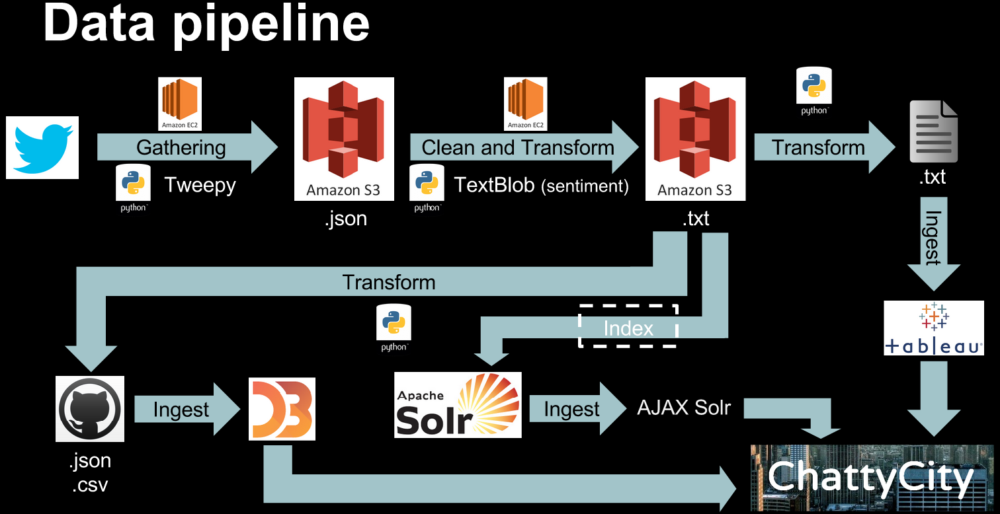
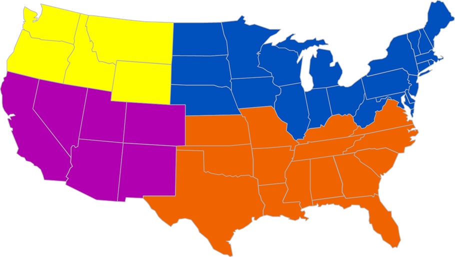
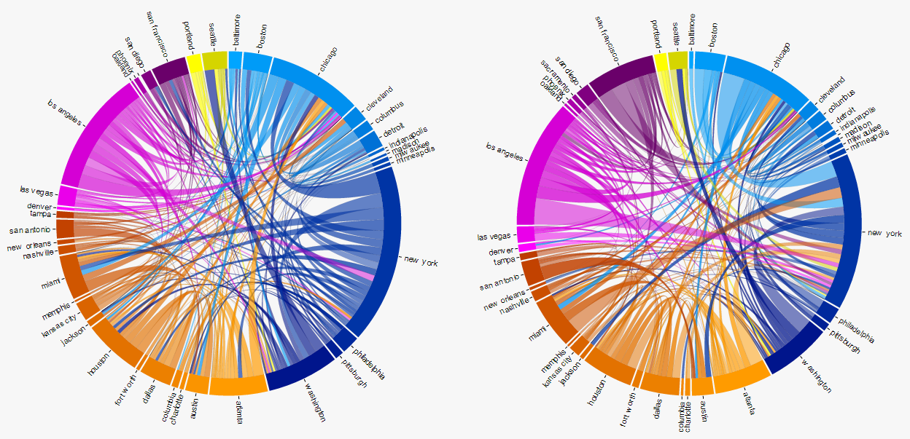
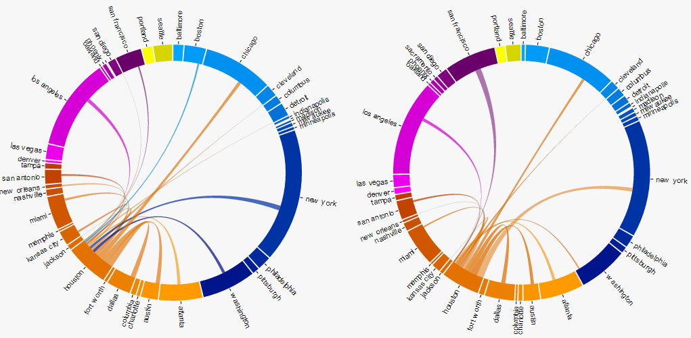
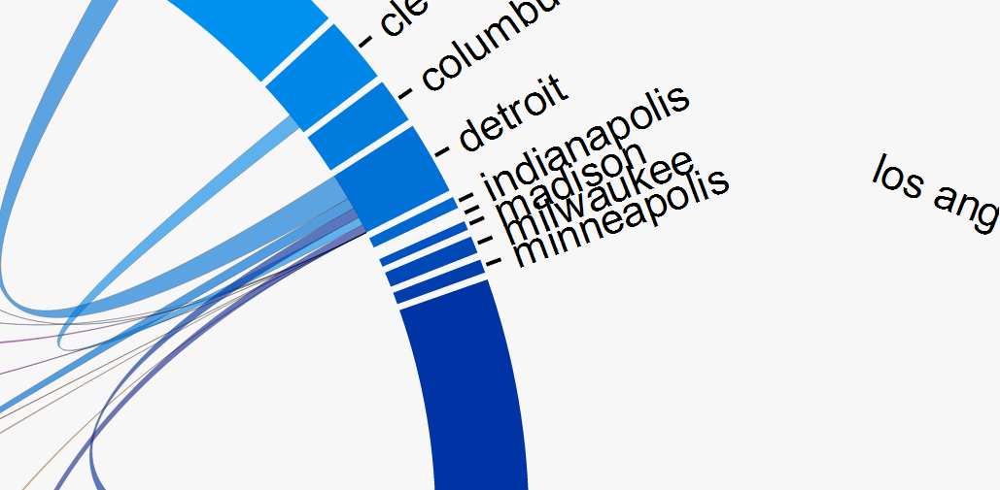
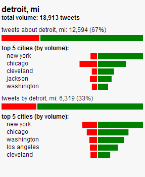
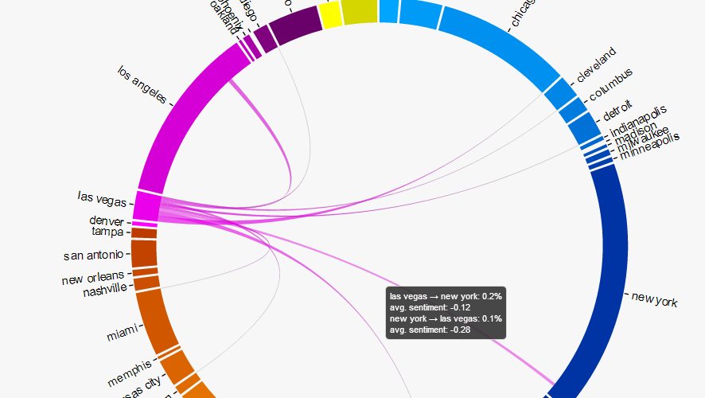
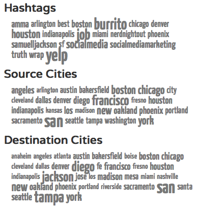

ChattyCity
=========

##Project description and goals

ChattyCity was designed and developed as a project to store, retrieve, visualize, and communicate data. Our project concept was to look at tweet sentiment (a general feeling or emotion, usually broken down as positive, negative, or neutral) based on tweeter's location (source) and where they are tweeting about (destination). We hypothesized that there is a bias for or against certain cities based on where the tweeter is from. For example, most residents in Seattle might have a positive sentiment about San Francisco, but residents of Los Angeles might generally have a negative sentiment toward San Francisco. 

We can determine what city a tweet is from if the tweet has geocoordinates associated with it. Or, if a user has defined their location, we can assume that the majority of their tweets will originate from that location. In the example shown below, the user says she is from Berkeley and her tweet shows positive sentiment for the city of Oakland.

We wanted to be able to answer questions from our data such as “which cities have positive sentiment toward San Francisco?” and “Does time of day and/or day of week influence sentiment?” We also wanted to look at whether sentiment is influenced by a number of different variables such as weather or major events like sports, but unfortunately ran out of time. Another goal was to create an interface to allow a user to search our collection of tweets.

##Tools
We utilized a number of different tools for this project. For gathering, cleansing, and transforming the data, we mostly used Python and a number of different Python libraries. We chose python because we were all at least partially familiar with it and found it easy to work with.
For visualization, we used both Tableau and [d3.js](http://d3js.org). We chose Tableau for the Learn section because it gave us a lot of flexibility to experiment with the data quickly and we wanted to take advantage of the new "Story Points" feature to take the user through a slideshow of interesting findings (although later we came across some limitation, which is further explained in the Tableau section below). For the Explore section of the project, we chose to use d3.js because we needed a tool that gave us more control over the visualization. 
For building the search system, we used [Apache Solr](http://lucene.apache.org/solr/) and [AJAX Solr](https://github.com/evolvingweb/ajax-solr). We used Solr as an IR solution instead of other search engines (elasticsearch, endeca, etc.) because we wanted an open source solution with a lot of documentation that is used in production.
And finally for the design of the website, we used [bootstrap.js](http://getbootstrap.com/).

##Data Pipeline
The visual below is an overview of our data pipeline for this project.

##Gathering Data
We decided to look at the 100 major US cities and see what they said about each other. The list of 100 cities include 50 state capitals and the 50 most populous US cities not state capitals. The list was curated manually using wikipedia.

State capitals: http://en.wikipedia.org/wiki/List_of_capitals_in_the_United_States

Most populous cities: http://en.wikipedia.org/wiki/List_of_United_States_cities_by_population

You can find the full list of cities in the cities_quad.txt file in the chord folder.

For each city, we recorded states, and added quadrant information based on an arbitrary breakdown of the US map into 4 areas (NE, SE, SW, NW) as depicted in the map below. The quadrants were used in the Explore section of the project to distinguish the different cities depicted in the chord diagrams.

After compiling the list of 100 cities, we then used Python’s Tweepy library to gather tweets that contained any of the 100 cities in the body of the tweet. In this phase we recorded full json objects, and decided that we would extract what we needed from the object after we were done with collecting the data. We ran the script on an Amazon Web Services (AWS) EC2 instance. During the period of data collection there were a number of interruptions which resulted in short gaps in our data collection. We ran the script for a total for 3 weeks, and during that time gathered nearly 15 million tweets, totalling about 15GB of data.

Here is a visualization of our tweet collection over the 3 week timespan (note that we didn't collect any tweets on July 9, 10, or 24):

You can find the code we used for the data extraction --here--.

##Parsing and Cleansing

After gathering all the data, we used Python for parsing the json objects to extracts our fields of interest. From each tweet object, we extracted a timestamp (UTC time zone), the location of the tweeter (if available), the geotagged location of the tweet (if available), and text of the tweet itself. In order to determine source city, we gave priority to the geotagged location, and then the location of the tweeter. If neither were available, we assigned a value of “none” to the source city. We then scanned each tweet to extract the destination city (what city the tweet was about), hashtags, and computed a sentiment score on the tweet using the [TextBlob](https://textblob.readthedocs.org/en/dev/) library. We finally stitched all the individuals files that were parsed together into a single tab separated text file, and added a unique ID field. The final schema for the clean data is below:

uid \t hashtags \t tstamp \t src_city_place \t src_city_user \t src_city \t dest_city \t tweet \t sentiment

you can find the source code for the all the transformations in the datacleaner folder.

###Transformation for Tableau:

To visualize sentiment vs. time of day/day of week for individual cities, it was necessary to convert the default UTC time to local time. In order to do this, we used [Batch Geocode](http://www.findlatitudeandlongitude.com/batch-geocode/#.U_YX2bxdVy8) to input a text file of the 100 cities and their states to get their latitude and longitude, manually added the timezone, and then used the python datetime and dateutil packages to convert from UTC to local time. Thinking it would be useful to normalize some of our data by city population (New York, NY is likely to have more tweets simply due to the fact that it has the largest population of potential tweeters), we also manually added the populations for each of the 100 cities on our list using the information listed in the wikipedia articles referenced above. Also, we filtered for the 100 cities, so the destination city column only has these cities on it, however, our source city (place) and source city (user) columns could have any location. It also might be interesting to look at cases for which the source city (place) and source city (user) differ, but we might want to limit it to only the cities on our list of 100, so these were additional columns created. The final (3.63GB!) text file imported into Tableau had the following columns:

* time_utc - Time of tweet in UTC
* time_local - Time of tweet in local time (only for tweets with geocoordinates associated)
* geo_city - Location of tweet (only for tweets with geocoordinates associated)
* geo_city_onlist - Location of tweet with geocoords (only if on our list of 100 cities)
* geo_city_onlist_lat - Latitude of tweet with geocoords (only if on our list of 100 cities)
* geo_city_onlist_lon - Longitude of tweet with geocoords (only if on our list of 100 cities)
* geo_city_onlist_pop - Population of geocoords (only if on our list of 100 cities)
* user_city - User-defined location
* user_city_onlist - User-defined location (only if on our list of 100 cities)
* user_city_onlist_lat - Latitude of user-defined location (only if on our list of 100 cities)
* user_city_onlist_lon - Longitude of user-defined location (only if on our list of 100 cities)
* user_city_onlist_pop - Population of user-defined location (only if on our list of 100 cities)
* dest_city - City on our list of 100 that was mentioned in the text of the tweet
* dest_city_lat - Latitude of destination city
* dest_city_lon - Longtitude of destination city
* dest_city_pop - Population of destination city
* tweet - Actual full text of tweet
* sentiment - Sentiment score (ranges from -1 to +1)

###Transformations for d3.js:

We needed to write another python script to perform a number of transformations on our main datafile to build a number of matrices and a list of list of cities for the chord diagrams. You can find the code for the transformations and the data ingestible by d3.js in the chord folder.

###Transformations for Solr:

For Solr, we had to reformat the timestamp field in order for Java to recognize that field as a time field. We also had to change the encoding of the tweets to UTF-8 and eliminate all leading and trailing quotations from the tweets.

##Learn

The idea for this section was to show the reader what we’ve learned from our exploration of the data. We used Tableau and it’s “Story Points” feature to take the reader through a guided tour of interesting findings.

###Process:

###Limitations:

Tableau doesn't allow users to freely publish dashboards made from datasets with over 1 million rows (ours had nearly 15 million). In order to be able to publish a story board on our website for users to interact with, we created an extract (subset) of the data that was less than 1 million rows. We chose to use the ~532,000 tweets that had geocoordinates associated with the tweet (for any location, not just limited to the 100 cities on our list).

###Evaluation of Results:

##Explore

Initially we were contempating wether to use a map-based visualization for the Explore section of the project or use [chord diagrams](http://bl.ocks.org/mbostock/4062006). We chose chord diagrams because we felt it would be hard to clearly show volume and directionality of connections between cities using a map. 

We decided to use two diagrams side-by-side because we were interested in showing directionality as well as sentiment. Using two diagrams, we could then use color to show directionality (color of paths connecting different cities) and sentiment using position (diagram on the left showing negative tweets, and the one on the right showing positive tweets.) In order to be able to see all tweets associated with each city, however, it was important that the diagrams be linked. This is accomplished through the [brushing and linking](http://en.wikipedia.org/wiki/Brushing_and_linking) technique. When a user hover over a city on one diagram, the same city is highlighted in the second diagram as well.

###Legibility:

We chose to include only the top 40 of the 100 cities in the Explore section mainly in favor of legibility. Because we have two diagrams side-by-side, we were limited in terms of the real estate we could work with on the screen, and so chose to show only 40 cities in order to avoid a lot of overlap between cities with smaller volumes of tweets. Even with 40 cities, we still had to manually eliminate label for Sacramento, CA and Lincoln, NB on the Negative diagram, and Lincoln, NB in the Positive diagram. We also implemented a proximity detection capability to the chord diagrams, which means when the mouse hovers close to a city in either of the chord diagrams, that city is highlighted.
Finally, in order to make it easier to hover over paths that might be too narrow to view normally, we added a zoom feature. Using the mouse wheel, the user can zoom into any section of the diagram and have a close look at the paths.

###Summary Information:

While it is visually pleasing to hover over the different cities and watch the diagrams change, we found it would be difficult glean insights such as ranking the top cities talking about a destination. In order to make this easier and also show a distribution of the overall tweets included in the visualization we implemented an information bar on the side below the legend where we show the top 5 cities (by volume) tweeting a certain city, and the top 5 cities that city is tweeting about. Hover over the individual diagrams we also reveal information about the volume of and the average sentiment of tweets moving between the cities.

###Process:
###Limitations:
###Evaluation of Results:

##Search
The purpose of the search section is to provide validation for our curated analyses and an enviornemnt for data discovery. AJAX-Solr was used as a temple for the underlying MVC framework as well as the jumping off point for the search’s UI layout.

####Faceted Search:
The faceted search on the sidebar uses a wordcloud visualization to indicate the most frequent term by size that are adjusted as constraints are made to the query. 

####Tweet and Tooltip:
We utilized  [Autolinker.js](https://github.com/gregjacobs/Autolinker.js) to make twitter handle and links clickable, which added a dimension of interactivity to the search section. Hovering over each tweet also provides “just in time” information with details of the tweet’s originating city (if available), the target city, and the tweet’s calculated sentiment. 

####Autocomplete:
The autocomplete function kicks in when a user begins to enter a query term using the terms from the solr index. We ultimately limited the suggestions to having at least 10 references in tweets to reduce the overwhelming number of options, but to also improve the experience by having the search render faster. The number of avaialble tweets with the search term are indicated in parentheses.

###Load:
Loading data to Solr for indexing was accomplished using a simple shell script that partitioned the data into smaller chunks and looped through the files posting it to solr via curl.
 
>  <code>
split -d -l 100000 tweet.csv tweet_split.
for file in `ls tweet_split.*`
do
curl "http://localhost:8983/solr/collection1/update/csv?commit=true&header=true&fieldnames=uid,hashtags,tstamp,src_city_place,src_city_user,src_city,dest_city,tweet,sentiment&separator=%09&encapsulator="&escape=/" --data-binary $file -H 'Content-type:text/csv; charset=utf-8'
done
</code>
 

In hindsight, we could have leveraged Solr’s DataImportHandler to ease addition of newly collected tweets and reindexing.

###Configuration:
Solr provides a great deal of abstraction and out of the box support for search; however, customizations were made to enhance user experience.

####solrconfig.xml
We reduced the number of warm up queries to one in order to reduce RAM usage and increase startup stability.

#####schema.xml
The solr data source is comprised of 7 fields that are indexed individually and one copy field that is a concatenation of tweet and city fields used for the search bar.

| Field   |      Type      |  Indexed | Stored | Required | Multi Values |
|----------|:----------------:|:-------------:|:--------:|:--------------:|:----------------:|
| UID |  string| true |true |true |false |
| Hashtags |    text_general  |  true |true | false | true|
| Tstamp| datetime|  true |true |true | false |
|Src_city|text_general|true|true|true|false|
|Dest_City|text_general|true|true|true|false|
|Tweet|text_general|true|true|true|false|
|Sentiment|double|true|true|true|false|
   
#####synonyms.txt
A synonym list was also used for a query time thesaurus that allows users to search for New York by typing NY.

#####stopwords.txt 
The stopwords list was used to decreased the size of index footprint (and increase speed) by removing common English words from the index process (e.g., the).

####Evaluations:

##Web Design

We used a one-page Bootstrap template ([Agency](http://startbootstrap.com/template-overviews/agency/) by [Start Bootstrap](http://startbootstrap.com/)) for our webpage design. The main font was changed to a san-serif for a more clean and modern look and we broke the content into five main sections:
   1. About - A brief overview of our project concept, data source, and tools we used.
   2. Learn - A guided tour of interesting findings via a Tableau Story visualization.
   3. Explore - The final interactive chord diagram visualization.
   4. Search - An interface for searching the tweets using Solr.
   5. Team - Information about us.
